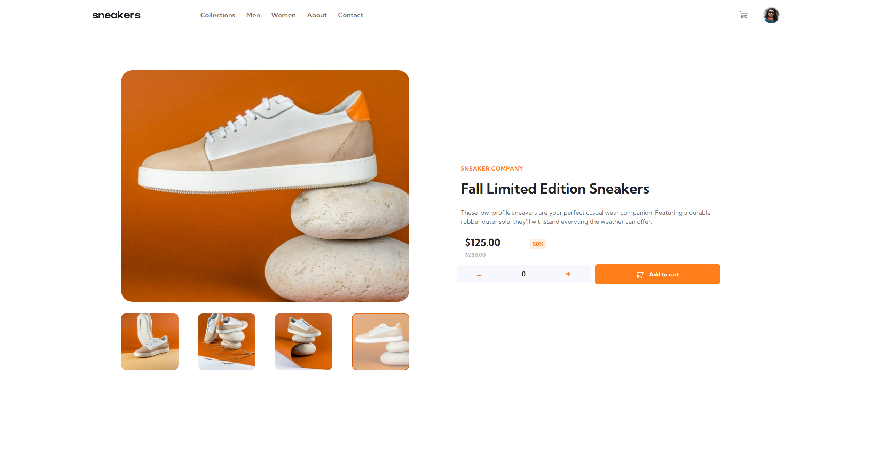
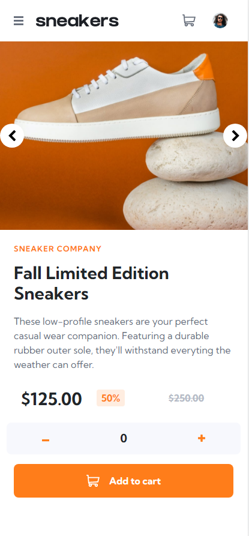

# Frontend Mentor - Ecommerce product page solution

This is a solution to the [Ecommerce product page challenge on Frontend Mentor](https://www.frontendmentor.io/challenges/ecommerce-product-page-UPsZ9MJp6).

## Table of contents

- [Overview](#overview)
  - [Screenshots](#screenshots)
  - [Links](#links)
- [My process](#my-process)
  - [Built with](#built-with)
  - [What I learned](#what-i-learned)
  - [Continued development](#continued-development)
  - [Useful resources](#useful-resources)
- [Author](#author)

## Overview

### Screenshots

### Links

- Solution URL: [GitHub Repo](https://github.com/tdtatum2/Product-Page)
- Live Site URL: [GitHub Pages](https://tdtatum2.github.io/Product-Page)

## My process

### Built with

- Semantic HTML5 markup
- CSS custom properties
- Flexbox
- Mobile-first workflow
- [React](https://reactjs.org/) - JS library
- [ReactBootstrap](https://react-bootstrap.github.io) - A Bootstrap library adapted for ReactJS

### What I learned

This challenge was a ton of fun! It felt nice to work on something that feels so close to what a real developer job might entail.

I learned a ton about React, Bootstrap, and custom CSS styling. I tried to break the components apart to make the code easier to understand and build upon. With that, came learning about passing state upwards: with parent components controlling the actual state and passing along handling functions to their child components. I learned a lot about Bootstrap modals and carousels as well, which made the project a lot easier to handle alone. Lastly, I learned a lot about custom CSS and overriding existing CSS within bootstrap to make sure my application looked as similar to the provided design as possible.

All in all, I'm super proud of this project and I definitely feel like I've become a better developer because of it.

### Continued development

Things I want to learn:
- Standard practices for structuring SCSS.
- Standard practices for creating (and the file structure for) React components.

### Useful resources

- [My Custom CSS Reset](https://www.joshwcomeau.com/css/custom-css-reset/) - A useful CSS Reset template by Josh W Comeau recommended to me by Kamlesh Rajesh Yadav in a comment on my first ever Frontend Mentor post!

## Author

- Website - [Fin](https://www.fintatum.com)
- Frontend Mentor - [@tdtatum2](https://www.frontendmentor.io/profile/tdtatum2)